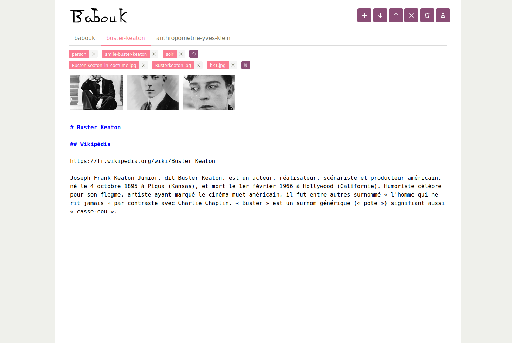

## What is Babouk



Babouk is a wiki engine. Its comprises a server named Ub and a graphical interface named Boka. Boka consists of three main visual areas:  a banner for launching actions – create, open, save, close, delete, sign in, sign up –, an area for drawing typed relations between pages or for attaching files, a page editor. Boka can also interact with other REST servers.

Why yet another wiki engine? Babouk is meant to be different along the following axis:
- Simple and trendy data model: progperty graphs, where each vertex is also a page
- Lightness in code size and memory footprint: minimal core with additional features provided as extensions
- Ability to run headless or with a user interface
- A single language for the server and the client: JavaScript (probably TypeScript in the future)

Read more at [babouk.net](https://babouk.net).

## Installation

The notes below are for an installation on a Linux-based operating system. 

Requirements:
- Git >= 2.27
- Node >= 13.3

### Node installation

```
curl -o- https://raw.githubusercontent.com/nvm-sh/nvm/v0.35.3/install.sh | bash
nvm install 13.13.0
```

### Yarn installation

```
curl -sS https://dl.yarnpkg.com/debian/pubkey.gpg | sudo apt-key add -
echo "deb https://dl.yarnpkg.com/debian/ stable main" | sudo tee /etc/apt/sources.list.d/yarn.list
sudo apt update && sudo apt install yarn
```

### Babouk installation 

```
git clone https://framagit.org/babouk/babouk.git
git clone https://github.com/babouk/remark-containers
cd remark-containers
git checkout other-attributes
cd ..
yarn global add stylus
cd babouk/modules/model && yarn install && yarn tsc && cd ..
cd zevir && yarn install && yarn tsc && cd ..
cd ub && yarn install && cp flexsearch/index.d.ts node_modules/flexsearch/ && yarn tsc && cd ..
cd sam && yarn install && yarn tsc && cd ..
cd boka && yarn install && yarn dev && yarn cssize && yarn cssize-bulma && cd ..
```

### Babouk sample sphere download

A sphere is a repository of resources for storing page content and media. Download a sample sphere as follows:

```
git clone https://framagit.org/babouk/sphere.git
```

Configure a local Git account in case you have not one already, that account will be used for commits from an unauthentified user:

```
git config --global user.email "you@example.com"
git config --global user.name "Name"
```

### Babouk configuration and launch

* Edit file `babouk/modules/ub/ub.yaml` and replace the directory names by the ones matching your local environment
* Go to `babouk/modules/ub` and run command `yarn start`
* Open a browser at http://localhost:3008/
* You should see the Babouk home page, from where you can sign up and start creating pages and rings


